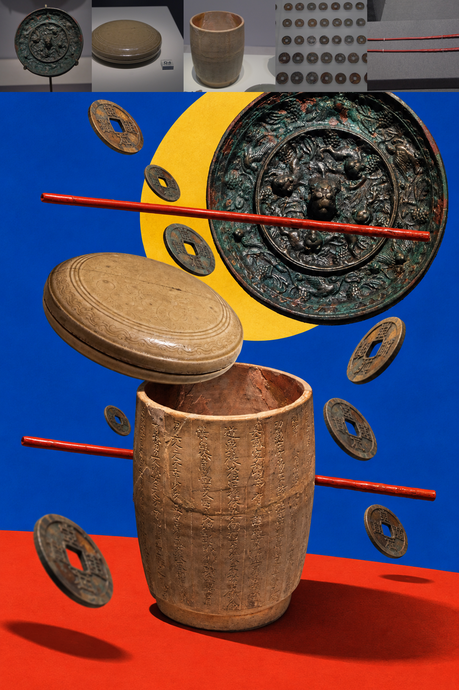
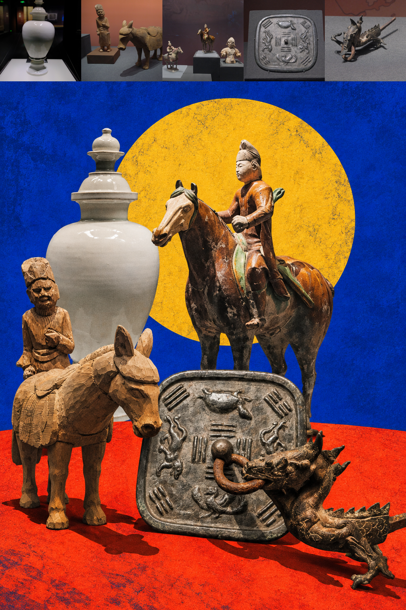

# 【S.013】Starryear-Artifact-collage丨年·文物五拼

将五张文物照片编排成一张竖版拼贴：顶端保留五张彩色来源图，下方以红、黄、蓝色块和器物之间的互动重构画面。

## 展示图

| 陶器与圆形器物 | 多件器物互动 |
| --- | --- |
|  |  |

## 下载 Skill

[下载完整 Skill ZIP](%E3%80%90S.013%E3%80%91Starryear-Artifact-collage%E4%B8%A8%E5%B9%B4%C2%B7%E6%96%87%E7%89%A9%E4%BA%94%E6%8B%BC.zip)。压缩包包含 `SKILL.md`、中英文提示词、使用说明、许可证和以上两张展示图。

仅限个人学习、非营利研究与非商业创作。商业使用须事先取得 Starryear年 书面许可。
